# 🚀 DropX – Secure Cloud Storage for Your Images & Files

DropX is a modern, full-stack cloud storage solution built with the latest web technologies. Effortlessly upload, organize, and manage your images and files with a beautiful UI, robust authentication, and lightning-fast performance.

---

	

---

## ✨ Features

- 🔒 **Secure Authentication** – Powered by Clerk for seamless, branded user management.
- 📁 **Folders & File Management** – Organize files in folders, star important files, and manage trash.
- ☁️ **ImageKit Integration** – Fast, optimized image uploads and delivery with advanced processing.
- 🗂️ **PDF & Image Support** – Restrict uploads to images and PDFs for safety and performance.
- 🗑️ **Trash & Restore** – Soft-delete files with a 30-day recovery window.
- ⭐ **Starred Files** – Mark important files for quick access.
- 🖼️ **Instant Previews** – View images directly in the app.
- 🧑‍💼 **User Profile** – View and manage your account, including email verification status.
- ⚡ **Real-time UI** – Instant feedback and updates with toasts and smooth transitions.
- 🛡️ **Role-based Access** – Secure file access and folder management per user.
- 🌙 **Dark Mode** – Beautiful, accessible design in both light and dark themes.

---

## 🛠️ Tech Stack

- **Next.js** – Latest app router, server components, and security middleware.
- **React** – Modern, performant UI.
- **Clerk** – Authentication and user management.
- **ImageKit** – Image storage, optimization, and delivery.
- **Neon PostgreSQL** – Serverless, scalable Postgres database.
- **Drizzle ORM** – Type-safe, modern ORM for schema and migrations.
- **Zod** – Schema validation for forms and API.
- **HeroUI** – Custom UI components for a polished look.
- **Lucide Icons** – Crisp, modern icons.
- **Tailwind CSS** – Utility-first styling.
- **date-fns** – Date formatting and manipulation.

---

## 🖼️ Screenshots

### 📝 Sign Up Page

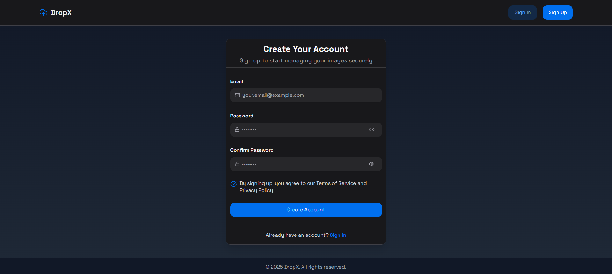
> **Create your DropX account:** Clean, modern sign-up form with validation and custom branding.

---

### 🔐 Strong Password Safety

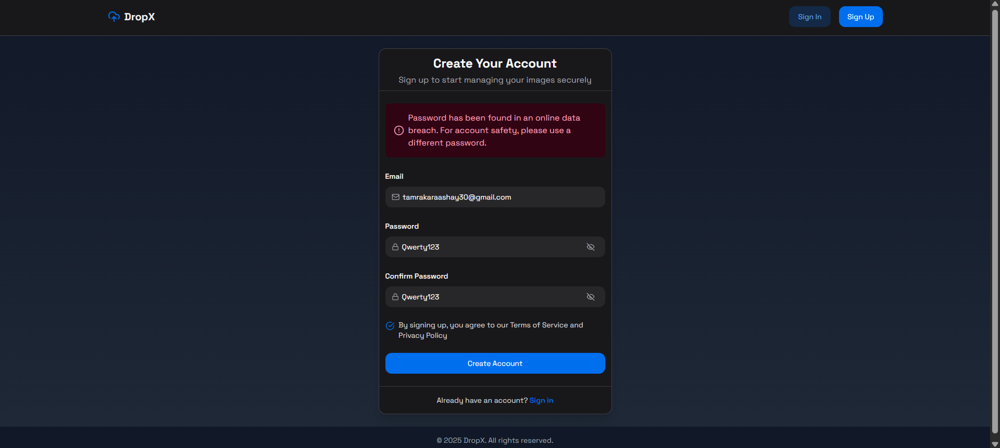
> **Password strength indicator:** Encourages users to set a secure password for their account.

---

### 📧 Email Verification

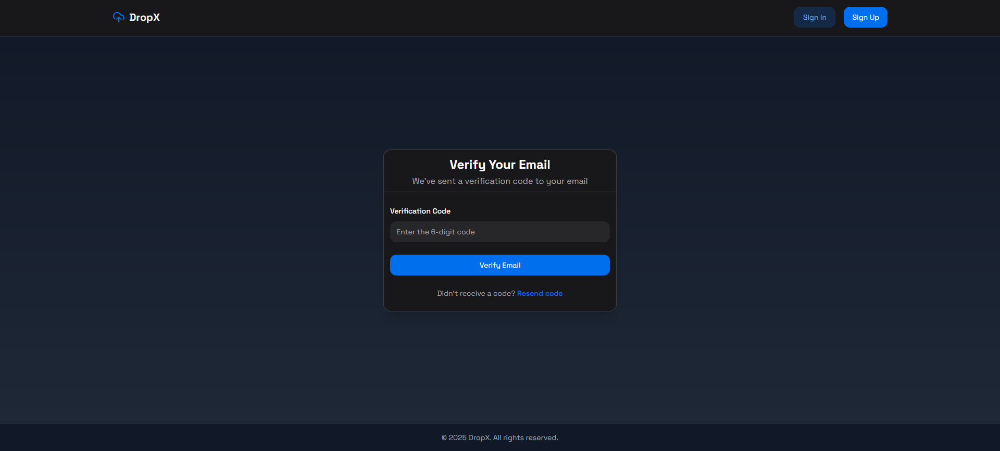
> **Verify your email:** Secure your account with a simple email verification step.

---

### 🔑 Sign In Page

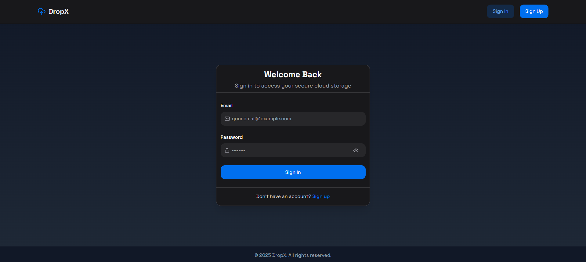
> **Access your cloud:** Elegant sign-in form with error handling and Clerk authentication.

---

### 🌐 Landing Page (Not Signed In)

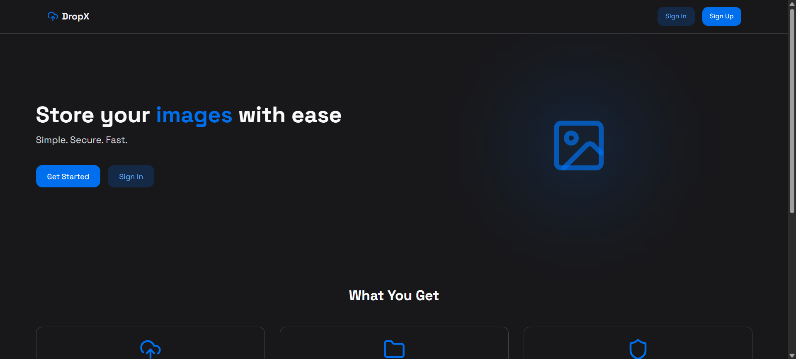
> **Welcome to DropX:** Discover features and sign up or sign in to get started.

---

### 🌐 Landing Page (Signed In)

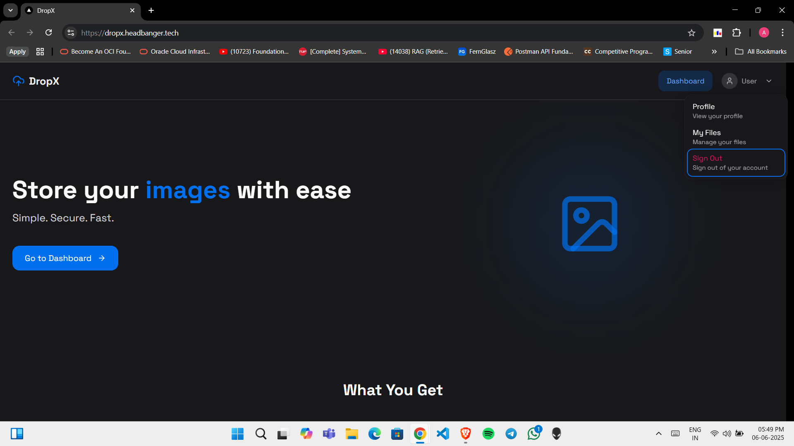
> **Personalized dashboard access:** See your files and quick actions after signing in.

---

### 🌟 Landing Page

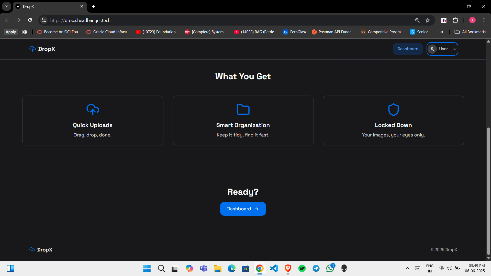
> **landing view:** Responsive design showcasing DropX’s capabilities.

---

### 📊 Dashboard

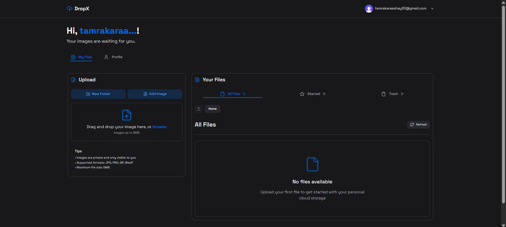
> **Your cloud workspace:** Manage, upload, and organize files and folders with ease.

---

### ⬆️ File Upload


> **Upload files instantly:** Drag-and-drop or browse to upload images and PDFs.

---

### 📁 New Folder Creation

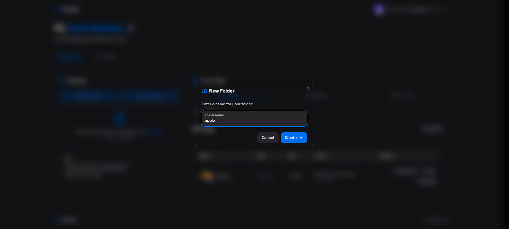
> **Organize your files:** Create new folders to keep your cloud storage tidy.

---

### 📂 New Folder Created

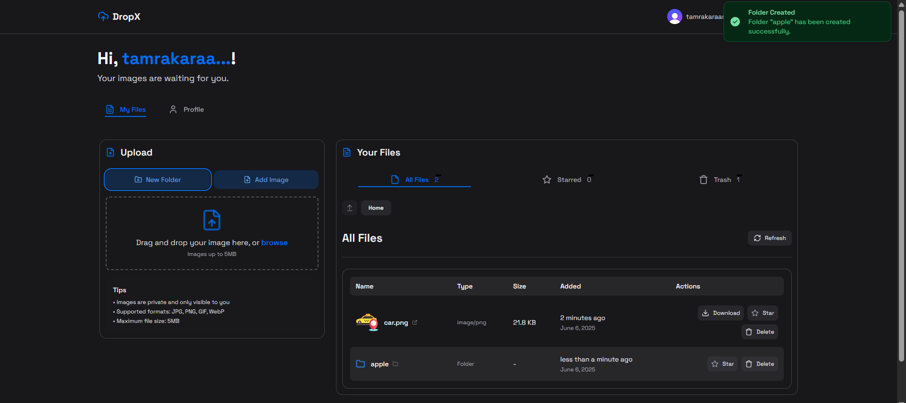
> **Folder added:** Instantly see your new folder in the file list.

---

### 📤 File Upload Inside Folder


> **Upload to folders:** Add files directly inside any folder for better organization.

---

### ⭐ Item Added to Star

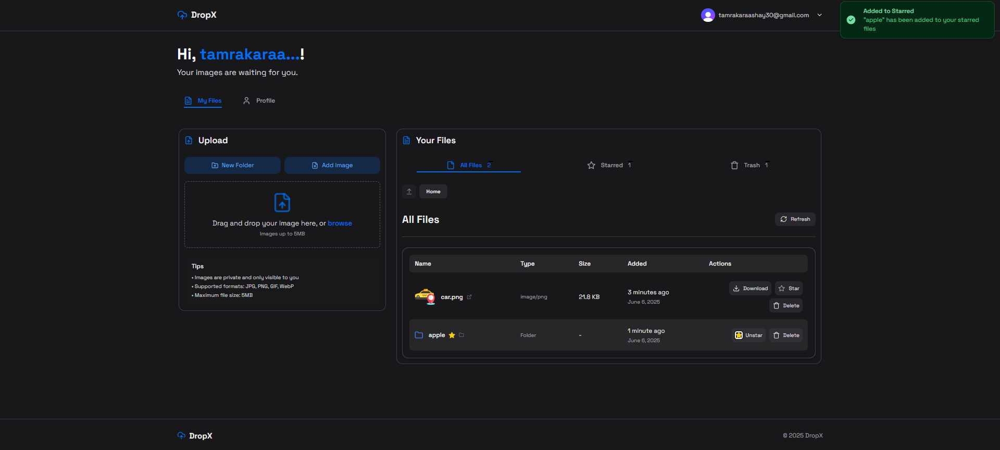
> **Star important files:** Mark files as favorites for quick access.

---

### ⭐ Starred Items List

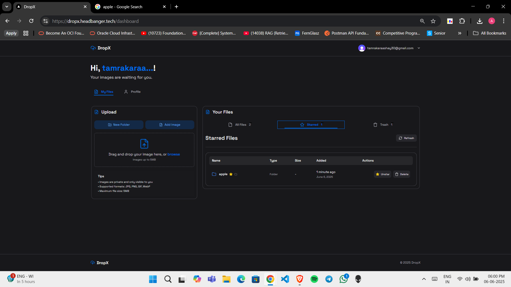
> **View starred files:** Easily find and manage your favorite files.

---

### 🗑️ Item Added to Trash

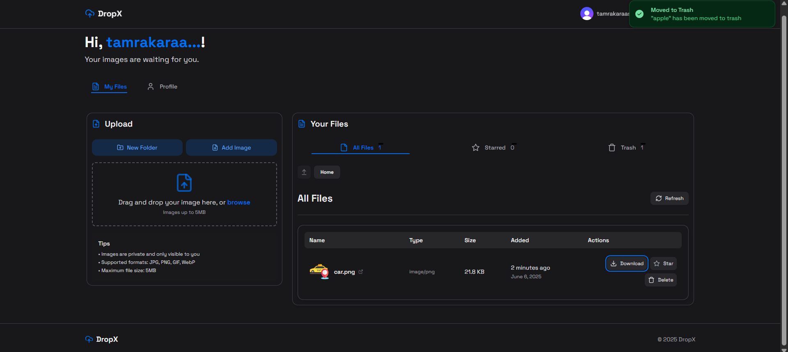
> **Soft delete:** Move files to trash with a single click—restore anytime within 30 days.

---

### 🗑️ Trash Items List

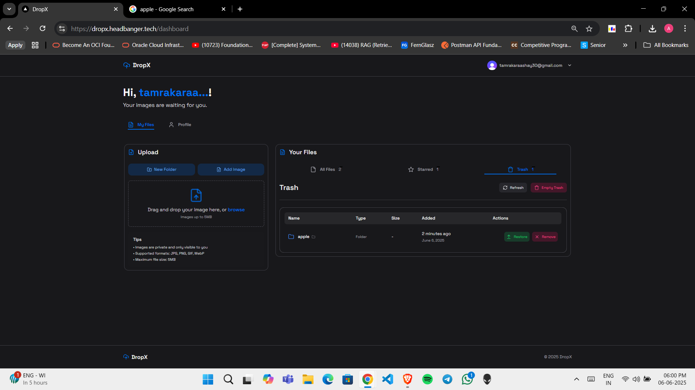
> **Manage trashed files:** View and restore or permanently delete files in trash.

---

### ♻️ Restore Item from Trash

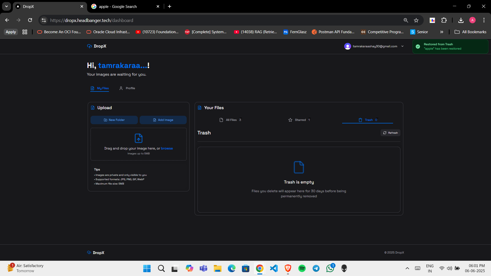
> **Undo delete:** Restore files from trash back to your main storage.

---

### ❌ Permanent Delete

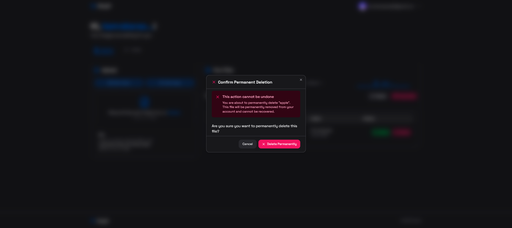
> **Permanent removal:** Confirm before deleting files forever for extra safety.

---

### 🧹 After Permanent Delete

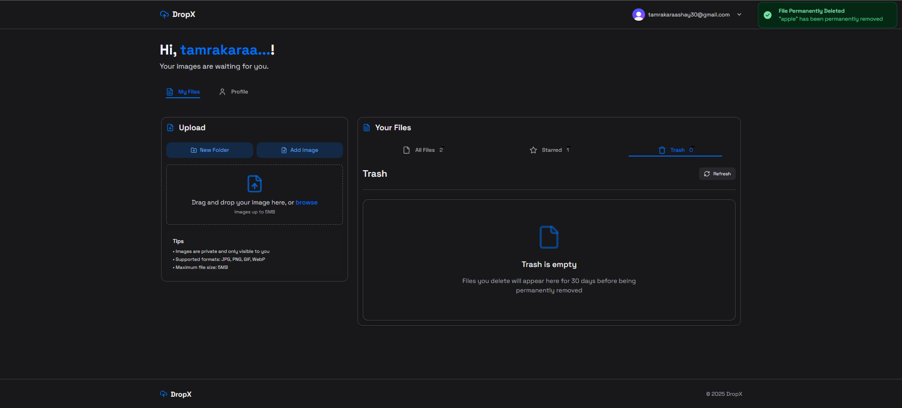
> **Cleaned up:** See your updated file list after permanent deletion.

---

### 🧹 Empty Trash (Delete Multiple Files)

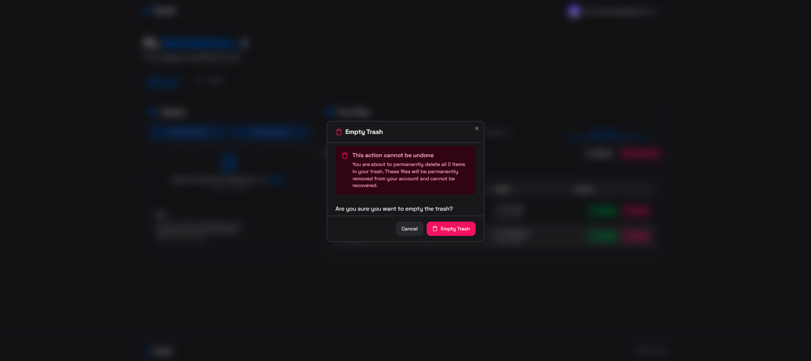
> **Bulk delete:** Empty your trash to permanently remove all deleted files at once.

---

### 🧹 After Empty Trash

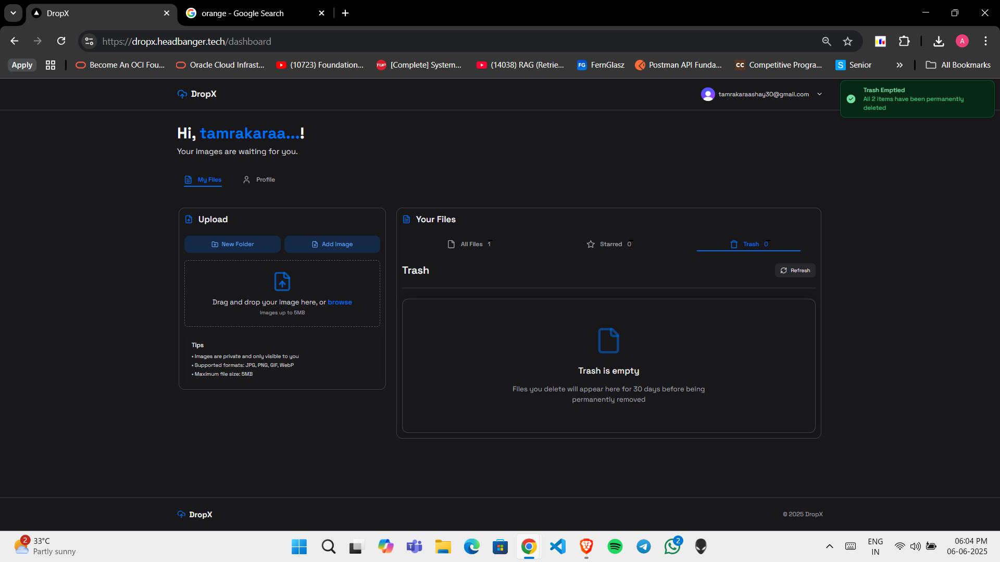
> **Trash emptied:** Your storage is now free of deleted files.

---

### 👤 User Profile Details

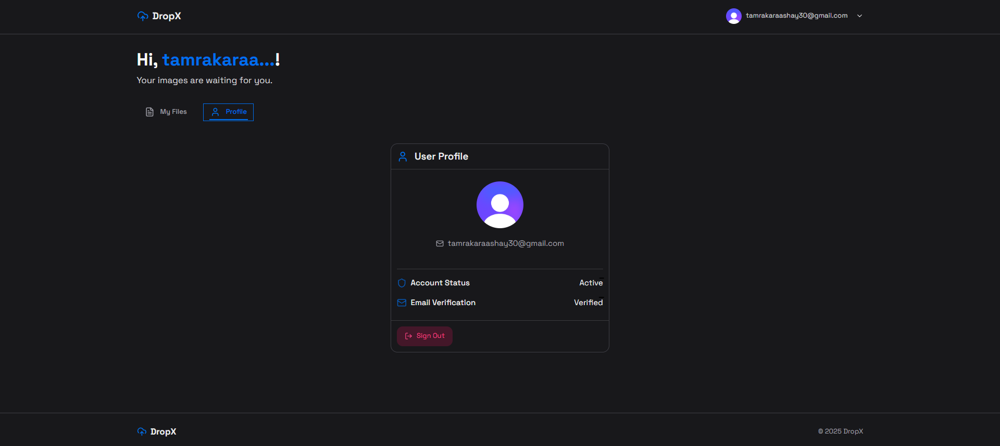
> **Profile overview:** View your account info, email status, and role badges.

---

### 🚪 Logout

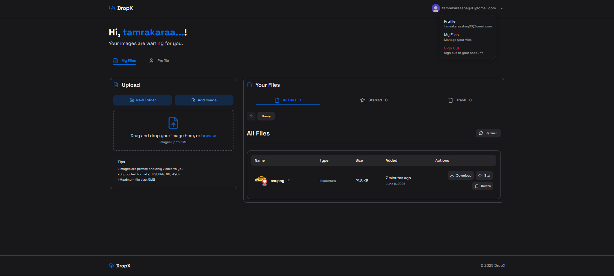
> **Sign out securely:** End your session and protect your cloud data.

---


## 📦 Getting Started

1. **Clone the repo:**
   ```sh
   git clone https://github.com/Aashay30/DropX.git
   cd DropX
   ```

2. **Install dependencies:**
   ```sh
    npm install
    npm run dev
   ```

3. **Set up environment variables:**

Copy .env.example to .env.local and fill in your keys for Clerk, ImageKit, and NeonDB.

4. **Run the development server:**
   ```sh
    npm run dev
   ```
   
5. Open http://localhost:3000 to view the app.

---

## 🧩 Challenges and Problems Faced During Development

Building **DropX** was a rewarding experience that also presented several technical and design challenges. Below are some of the key problems encountered and how they were addressed:

---

### 🔐 Clerk Integration & Role Management
Integrating Clerk for authentication and user management required careful configuration to ensure secure, seamless onboarding. Handling edge cases like email verification status, role-based access control, and protecting sensitive routes added complexity.

> **Solution:** Leveraged Clerk middleware and client APIs to build conditional UI elements, enforce email verification, and manage roles (admin, user) across server and client components.

---

### 🗂️ Nested Folder & File Management
Designing an intuitive and scalable folder-file hierarchy was tricky, especially when enabling CRUD operations with relational constraints using PostgreSQL.

> **Solution:** Structured the database with clear parent-child relationships using foreign keys and recursive queries, and used Drizzle ORM for type-safe and consistent access.

---

### 🖼️ Real-time Image Optimization with ImageKit
Handling large image uploads while ensuring optimal delivery and display across devices was a significant hurdle.

> **Solution:** Integrated ImageKit's client SDK and transformed images on the fly using URL-based parameters for compression, resizing, and caching.

---

### 🗑️ Soft Delete & Trash Recovery Logic
Implementing a reliable trash system with 30-day recovery required managing soft-deletes at both database and UI layers, along with time-based expiration handling.

> **Solution:** Added `deletedAt` timestamps and conditional filters in queries, along with periodic UI feedback and restore options.

---

### 🌙 Light/Dark Theme Toggle
Ensuring consistent theme behavior across client-rendered and server-rendered pages involved syncing dark/light mode preferences via Tailwind and hydration-safe logic.

> **Solution:** Used `next-themes` for persistent theme control, along with Tailwind’s `dark:` variants and responsive component design.

---

### 🧑‍💻 Clerk + Server Components Compatibility
Since Clerk heavily relies on client context, combining it with Next.js server components introduced challenges, especially around authentication and conditional rendering.

> **Solution:** Used Clerk’s server-side helpers (`auth()` and `getAuth()`) in server components and API routes while keeping sensitive logic server-only.

---

### 🚀 Deployment & Environment Config
Configuring deployment with Vercel while managing secrets for Clerk, ImageKit, and NeonDB securely and correctly across environments (dev, staging, prod) required extra care.

> **Solution:** Set up `.env.local` files, environment variable checks, and used Vercel’s environment management to keep secrets safe and consistent.

---

### 📦 Drizzle ORM Migrations
Working with a newer ORM like Drizzle introduced learning curve around schema generation, migrations, and advanced SQL operations.

> **Solution:** Invested time in understanding Drizzle’s approach to declarative schema definitions and built reusable migration patterns.

---

These challenges helped improve the architecture, developer experience, and robustness of the final product. Each issue brought deeper understanding of modern full-stack development with **Next.js App Router**, **Clerk**, **Tailwind**, and **PostgreSQL**.

---

## 🧩 Challenges & Problems Faced During Development (Interview-Focused)

Building **DropX** involved tackling several complex, real-world issues — each of which sharpened my ability to think critically, debug effectively, and make informed engineering decisions. These challenges reflect the kind of scenarios often brought up in **technical interviews, system design rounds, and behavioral assessments**.

---

### 🔐 1. Clerk Integration & Role-Based Access Control (RBAC)
**Challenge:** Configuring Clerk for auth was non-trivial — managing email verification, server-client auth state sync, and conditional access based on user roles (admin/user).

**What I Did:**
- Implemented **Clerk middleware** and **client-side guards** to enforce route protection and UI-level visibility.
- Used **Clerk’s server-side helpers** to ensure secure SSR in Next.js App Router.
- **Interview Relevance:** Demonstrates deep understanding of **auth flows**, **RBAC**, and managing auth across client-server boundaries — frequently asked in system design and backend interviews.

---

### 🗂️ 2. Nested Folder & File Hierarchy Modeling
**Challenge:** Designing a scalable, recursive folder/file structure with PostgreSQL and handling constraints like unique names, parent-child relationships, and cascading deletes.

**What I Did:**
- Created a normalized schema with **self-referencing foreign keys** and implemented **soft delete** logic.
- Used **Drizzle ORM** for type-safe schema migrations and **recursive queries** to render nested views.
- **Interview Relevance:** Showcases database schema design, data modeling for tree structures, and ORM proficiency — ideal for backend or database-heavy roles.

---

### 🖼️ 3. Real-Time Image Handling & Optimization
**Challenge:** Uploading large files without slowing down the UI, and delivering optimized previews across device types.

**What I Did:**
- Integrated **ImageKit SDK** for real-time compression, transformation, and delivery via URL params.
- Optimized upload performance with feedback loaders and lazy loading.
- **Interview Relevance:** Highlights experience with media optimization, CDN usage, and performance tuning — useful in frontend performance or infra rounds.

---

### 🗑️ 4. Soft Delete & Trash Recovery
**Challenge:** Implementing a user-friendly trash system with time-bound recovery (30 days) and permanent deletion.

**What I Did:**
- Added a `deletedAt` timestamp for soft deletes and filtered views accordingly.
- Built periodic purge logic and restore capabilities in UI with user confirmations.
- **Interview Relevance:** Demonstrates handling of **lifecycle management**, **temporal logic**, and **non-trivial state transitions** — great for product-focused or system design questions.

---

### 🌙 5. Theme Toggle with Hydration-Safe Logic
**Challenge:** Maintaining light/dark theme consistency across SSR and CSR without hydration mismatch.

**What I Did:**
- Used `next-themes` for persistence and Tailwind’s `dark:` variants to keep styling declarative and scalable.
- Ensured hydration safety by conditionally rendering after mount.
- **Interview Relevance:** Good talking point for frontend interviews where **SSR/CSR synchronization**, **UX consistency**, and **accessibility** are discussed.

---

### 🧑‍💻 6. Clerk + Server Components Compatibility
**Challenge:** Integrating Clerk (which relies on client context) with Next.js Server Components — especially in protected server-rendered routes.

**What I Did:**
- Used Clerk's `auth()` and `getAuth()` in server actions and loaders to maintain secure server-side rendering.
- Handled client-only logic carefully to avoid SSR-related crashes.
- **Interview Relevance:** Shows fluency with **Next.js App Router internals**, server/client boundaries, and third-party SDK integration — common in frontend/full-stack interviews.

---

### 🚀 7. Secure Deployment & Environment Config
**Challenge:** Managing secrets and environment-specific settings across dev, staging, and production in Vercel.

**What I Did:**
- Created `.env.local` configs, used Vercel’s environment manager, and sanitized client-server variable usage.
- Ensured no secrets leaked during build or runtime.
- **Interview Relevance:** Highlights **deployment readiness**, **CI/CD awareness**, and **secure config management** — useful in DevOps/backend discussions.

---

### 📦 8. Learning Curve with Drizzle ORM
**Challenge:** Drizzle was a newer ORM with limited documentation — initially confusing for advanced schema definitions, relations, and raw SQL fallbacks.

**What I Did:**
- Studied the codebase and community examples to learn migration patterns.
- Built reusable schema components for consistent database interactions.
- **Interview Relevance:** Demonstrates adaptability, rapid learning of new tools, and confidence in **SQL + ORM concepts** — often explored in backend interviews.

---

> ✅ Each of these challenges helped me become a more thoughtful, product-oriented developer. They reflect not only technical ability but also decision-making, debugging, and the ability to ship robust features — qualities that are critical in real-world engineering roles and interviews.


---

## 🎯 Key Takeaways from the Project

Building **DropX** was not just about implementing a cloud storage solution — it was a deep dive into modern full-stack development practices and architecture. Below are the major insights and learnings gained throughout the journey:

---

### 🧱 Full-Stack Architecture Mastery
Gained hands-on experience with the latest **Next.js App Router** features like server components, dynamic routing, layout nesting, and middleware — helping build a scalable and modular architecture.

---

### 🔐 Seamless Authentication Workflows
Learned to integrate **Clerk** for secure and branded authentication, along with role-based access control and email verification — making user management both robust and user-friendly.

---

### 💾 Efficient Data Modeling
Understood the importance of **relational database design** using **Neon PostgreSQL**, especially when modeling hierarchical data (folders/files) and implementing soft-delete logic.

---

### ⚙️ API & Schema Validation
Implemented end-to-end data safety using **Zod** for schema validation, ensuring consistent client-server communication and preventing malformed data entries.

---

### 🎨 Scalable Component Design
Used **Tailwind CSS** and **HeroUI** to build a clean, responsive, and theme-aware UI, reinforcing the importance of design systems and utility-first styling in production apps.

---

### 🧠 Real-World Problem Solving
Faced and solved real-world challenges like:
- Soft delete with trash and restore logic
- Optimized image delivery via **ImageKit**
- Handling file operations and role-guarded access
- Managing edge cases like hydration mismatches and auth context in server components

---

### 🚀 Deployment and CI/CD Best Practices
Learned how to configure **Vercel deployment**, manage secrets across environments, and ensure that build processes remain stable, efficient, and secure.

---

### 📂 Better Project Organization
Practiced clean folder structuring, reusable hooks, and modular components to make the codebase easier to scale and maintain.

---

### 🔁 Feedback-Driven Development
Used visual feedback (toasts, loaders) and real-time state updates to improve the user experience — highlighting the impact of micro-interactions on usability.

---

## 🎯 Key Takeaways from the Project (Interview-Focused)

Working on **DropX** helped me apply and deepen practical skills across the full stack. These takeaways not only enhanced my technical foundation but also strengthened my system design and problem-solving mindset — making me better prepared for real-world engineering roles and interviews.

---

### 🧱 1. Modular and Scalable Full-Stack Architecture
- Gained hands-on experience using **Next.js App Router** with server/client components, middleware, and layouts to design scalable applications.
- Learned to split concerns between frontend, backend, and API layers — a critical aspect discussed in system design interviews.

---

### 🔐 2. Secure Auth with Clerk (Role-Based Access Control)
- Integrated **Clerk** to build branded, secure auth with email verification and role-based access.
- Valuable for demonstrating understanding of **authentication flows**, **session management**, and **RBAC** in interviews.

---

### 🧠 3. Data Modeling & Schema Design with PostgreSQL + Drizzle
- Designed normalized schemas for hierarchical file/folder structures with soft-deletion (Trash).
- Practiced writing **migrations**, **relations**, and handling **edge cases** like cascading deletes or renames — highly relevant for backend or database-focused roles.

---

### 🧪 4. Data Validation & API Safety
- Used **Zod** to enforce schema validation on both client and server.
- Helped in understanding **API contract integrity**, which is often tested in **API design** or **backend interviews**.

---

### ⚡ 5. Optimized UX with ImageKit & Real-Time Feedback
- Integrated **ImageKit** for instant image delivery and used toasts/loaders for real-time UI.
- Reinforced the importance of **perceived performance** and **user feedback**, useful in front-end interviews.

---

### 🧩 6. Component-Driven Development with Tailwind & HeroUI
- Built reusable, accessible components with **Tailwind CSS** and **HeroUI**.
- Focused on writing **clean, maintainable** UI logic — a good talking point in **frontend design** rounds.

---

### 🔄 7. Handling Real-World Problems & Edge Cases
- Tackled practical scenarios like:
  - **Soft delete with recovery window**
  - File type restrictions (images/PDFs only)
  - Fallbacks for failed uploads or network issues
- Demonstrates experience beyond CRUD apps — important when asked about **challenges you've solved** in interviews.

---

### ⚙️ 8. Deployment, Environment Config & Vercel CI/CD
- Managed secrets, environments, and production builds using **Vercel**.
- Ready to talk about **deployment pipelines**, **build failures**, and **production readiness** in DevOps or backend rounds.

---

### 🧹 9. Codebase Management & Clean Architecture
- Followed principles like **separation of concerns**, **reusable hooks**, and **modular layouts**.
- Improved ability to discuss **code maintainability**, **readability**, and **scalability** — a frequent topic in behavioral or code review interviews.

---

### 🧠 10. Thinking Like a Product Engineer
- Focused on:
  - What makes a good user experience?
  - Where can the app fail and how should it recover?
  - What if 10,000 users sign up tomorrow?
- These are questions hiring managers love to see you think about — showing **ownership mindset** and **product thinking**.

---

> ✅ Overall, DropX gave me a strong foundation in designing and building real-world, scalable web applications. The problems tackled and solutions built are not just technical exercises — they reflect the depth of thought, planning, and system design expected in real-world engineering roles.

---

---

## ⭐ DropX Project: STAR-Format Behavioral Interview Answers

Use these as ready-made templates for behavioral interview questions about technical challenges, learning, and problem-solving.

---

### 🔐 Clerk Integration & RBAC

- **Situation:** We needed secure authentication and role-based access in DropX.
- **Task:** Implement Clerk to manage auth and restrict access based on roles.
- **Action:** Integrated Clerk’s client/server APIs, added email verification, and set up role guards using middleware and conditional UI.
- **Result:** Delivered a secure auth system with seamless onboarding and reliable role-based UI rendering, improving the app’s access control.

---

### 🗂️ Folder-File Hierarchy with PostgreSQL

- **Situation:** Users needed to organize files into nested folders.
- **Task:** Design a database schema supporting recursive folder structures.
- **Action:** Created a self-referencing table using Drizzle ORM, handled cascading soft-deletes, and optimized retrieval using recursive queries.
- **Result:** Achieved a robust and scalable file system, which handled edge cases like rename, restore, and deletion efficiently.

---

### 🖼️ Real-Time Image Optimization

- **Situation:** Large image uploads slowed down the UI and load times.
- **Task:** Ensure fast, responsive image loading across devices.
- **Action:** Integrated ImageKit for on-the-fly image transformations and added responsive previews with loading states.
- **Result:** Enhanced perceived performance and user experience significantly, with minimal latency on uploads or previews.

---

### 🗑️ Soft Delete & Trash Recovery

- **Situation:** Users wanted the ability to recover deleted files.
- **Task:** Implement a trash system with a 30-day recovery window.
- **Action:** Used a `deletedAt` field to soft-delete, built restore logic in UI, and filtered queries based on time-based conditions.
- **Result:** Enabled non-destructive deletes, which improved user trust and flexibility in file management.

---

### 🌙 Theme Toggle & Hydration Handling

- **Situation:** The app required dark mode with SSR support.
- **Task:** Implement a theme toggle without causing hydration issues.
- **Action:** Used `next-themes` for persistent theme handling and ensured hydration safety with client-only guards.
- **Result:** Delivered a consistent light/dark theme UX across all pages, including server-rendered routes.

---

### 🧑‍💻 Clerk with Next.js Server Components

- **Situation:** Clerk’s client-centric nature conflicted with Server Components in Next.js.
- **Task:** Securely manage auth across both client and server layers.
- **Action:** Utilized Clerk’s `auth()`/`getAuth()` on server routes, and carefully separated logic between server-only and client-only contexts.
- **Result:** Maintained secure access control without breaking SSR functionality or leaking sensitive data.

---

### 🚀 Vercel Deployment & Secrets Management

- **Situation:** Needed to deploy securely with different environments (dev/prod).
- **Task:** Configure secrets and environment variables across environments.
- **Action:** Used `.env` files and Vercel’s environment manager to safely isolate variables, including Clerk and DB credentials.
- **Result:** Enabled seamless CI/CD workflows and ensured no secrets were leaked during deployment.

---

### 📦 Learning a New ORM (Drizzle)

- **Situation:** Drizzle ORM was relatively new with limited documentation.
- **Task:** Set up relational schemas and migrations quickly.
- **Action:** Explored community resources, built modular schema components, and wrote migration scripts.
- **Result:** Successfully handled complex schema relationships and became proficient in Drizzle — a skill transferable to other ORM tools.

---

This project was a significant milestone in sharpening my skills across front-end, back-end, DevOps, and product thinking — and laid a strong foundation for building robust, scalable web applications in production environments.
