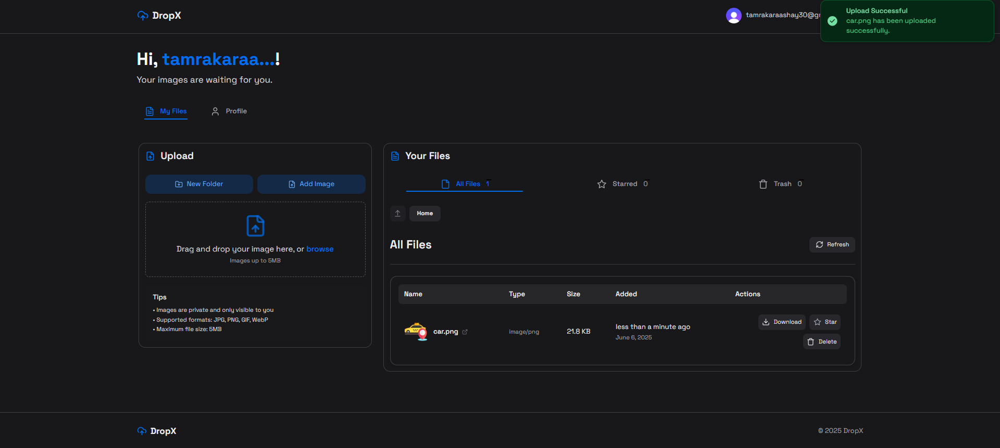
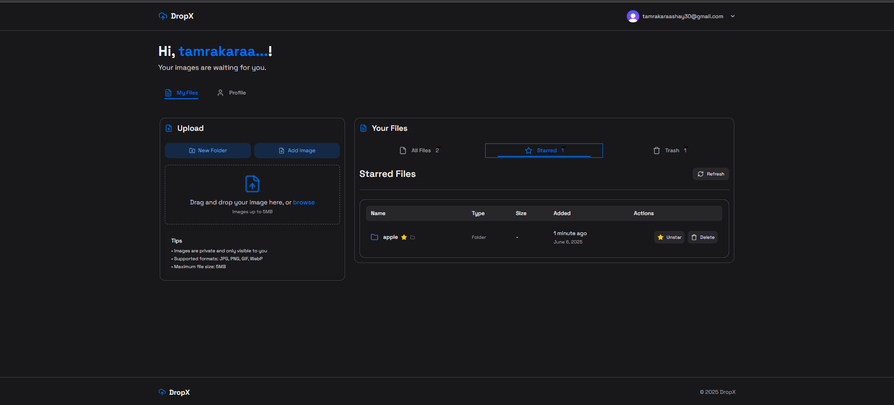
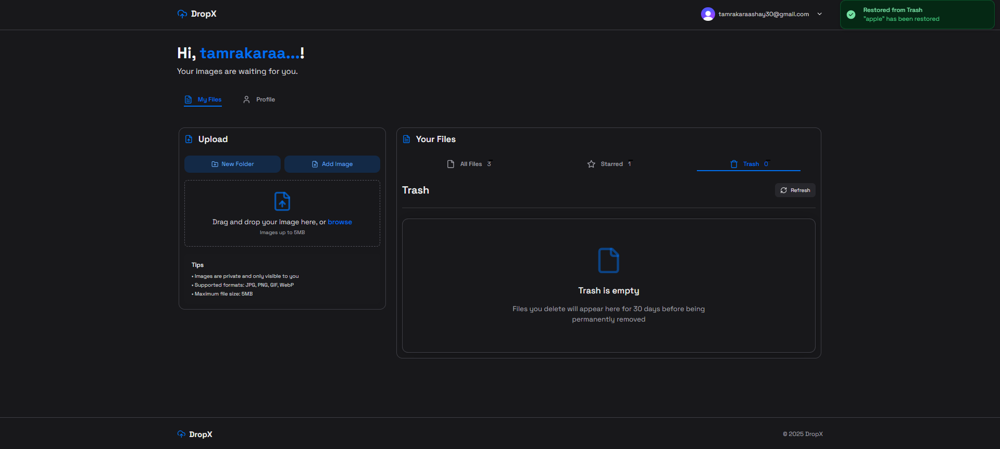
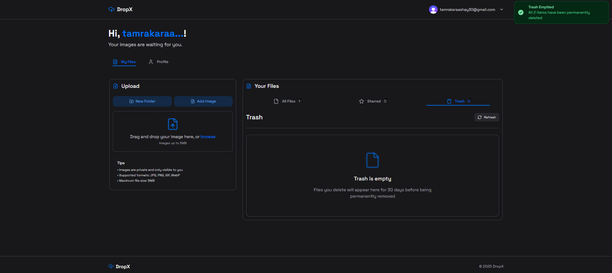

# 🚀 DropX – Secure Cloud Storage for Your Images & Files

DropX is a modern, full-stack cloud storage solution built with the latest web technologies. Effortlessly upload, organize, and manage your images and files with a beautiful UI, robust authentication, and lightning-fast performance.

---

	

---

## ✨ Features

- 🔒 **Secure Authentication** – Powered by Clerk for seamless, branded user management.
- 📁 **Folders & File Management** – Organize files in folders, star important files, and manage trash.
- ☁️ **ImageKit Integration** – Fast, optimized image uploads and delivery with advanced processing.
- 🗂️ **PDF & Image Support** – Restrict uploads to images and PDFs for safety and performance.
- 🗑️ **Trash & Restore** – Soft-delete files with a 30-day recovery window.
- ⭐ **Starred Files** – Mark important files for quick access.
- 🖼️ **Instant Previews** – View images directly in the app.
- 🧑‍💼 **User Profile** – View and manage your account, including email verification status.
- ⚡ **Real-time UI** – Instant feedback and updates with toasts and smooth transitions.
- 🛡️ **Role-based Access** – Secure file access and folder management per user.
- 🌙 **Dark Mode** – Beautiful, accessible design in both light and dark themes.

---

## 🛠️ Tech Stack

- **Next.js** – Latest app router, server components, and security middleware.
- **React** – Modern, performant UI.
- **Clerk** – Authentication and user management.
- **ImageKit** – Image storage, optimization, and delivery.
- **Neon PostgreSQL** – Serverless, scalable Postgres database.
- **Drizzle ORM** – Type-safe, modern ORM for schema and migrations.
- **Zod** – Schema validation for forms and API.
- **HeroUI** – Custom UI components for a polished look.
- **Lucide Icons** – Crisp, modern icons.
- **Tailwind CSS** – Utility-first styling.
- **date-fns** – Date formatting and manipulation.

---

## 🖼️ Screenshots

### 📝 Sign Up Page


> **Create your DropX account:** Clean, modern sign-up form with validation and custom branding.

---

### 🔐 Strong Password Safety


> **Password strength indicator:** Encourages users to set a secure password for their account.

---

### 📧 Email Verification


> **Verify your email:** Secure your account with a simple email verification step.

---

### 🔑 Sign In Page


> **Access your cloud:** Elegant sign-in form with error handling and Clerk authentication.

---

### 🌐 Landing Page (Not Signed In)


> **Welcome to DropX:** Discover features and sign up or sign in to get started.

---

### 🌐 Landing Page (Signed In)


> **Personalized dashboard access:** See your files and quick actions after signing in.

---

### 🌟 Landing Page


> **landing view:** Responsive design showcasing DropX’s capabilities.

---

### 📊 Dashboard


> **Your cloud workspace:** Manage, upload, and organize files and folders with ease.

---

### ⬆️ File Upload


> **Upload files instantly:** Drag-and-drop or browse to upload images and PDFs.

---

### 📁 New Folder Creation


> **Organize your files:** Create new folders to keep your cloud storage tidy.

---

### 📂 New Folder Created


> **Folder added:** Instantly see your new folder in the file list.

---

### 📤 File Upload Inside Folder


> **Upload to folders:** Add files directly inside any folder for better organization.

---

### ⭐ Item Added to Star


> **Star important files:** Mark files as favorites for quick access.

---

### ⭐ Starred Items List


> **View starred files:** Easily find and manage your favorite files.

---

### 🗑️ Item Added to Trash


> **Soft delete:** Move files to trash with a single click—restore anytime within 30 days.

---

### 🗑️ Trash Items List


> **Manage trashed files:** View and restore or permanently delete files in trash.

---

### ♻️ Restore Item from Trash


> **Undo delete:** Restore files from trash back to your main storage.

---

### ❌ Permanent Delete


> **Permanent removal:** Confirm before deleting files forever for extra safety.

---

### 🧹 After Permanent Delete


> **Cleaned up:** See your updated file list after permanent deletion.

---

### 🧹 Empty Trash (Delete Multiple Files)


> **Bulk delete:** Empty your trash to permanently remove all deleted files at once.

---

### 🧹 After Empty Trash


> **Trash emptied:** Your storage is now free of deleted files.

---

### 👤 User Profile Details


> **Profile overview:** View your account info, email status, and role badges.

---

### 🚪 Logout


> **Sign out securely:** End your session and protect your cloud data.

---


## 📦 Getting Started

1. **Clone the repo:**
   ```sh
   git clone https://github.com/Aashay30/DropX.git
   cd DropX
   ```

2. **Install dependencies:**
   ```sh
    npm install
    npm run dev
   ```

3. **Set up environment variables:**

Copy .env.example to .env.local and fill in your keys for Clerk, ImageKit, and NeonDB.

4. **Run the development server:**
   ```sh
    npm run dev
   ```
   
5. Open http://localhost:3000 to view the app.
